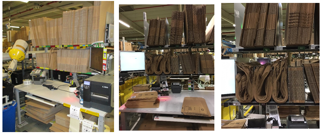
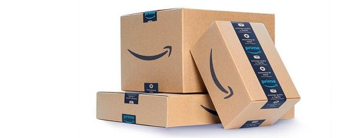
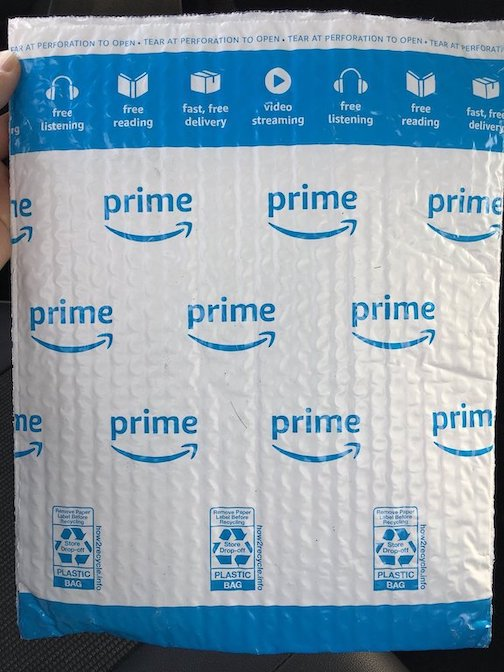
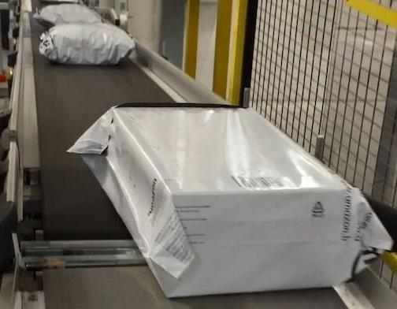
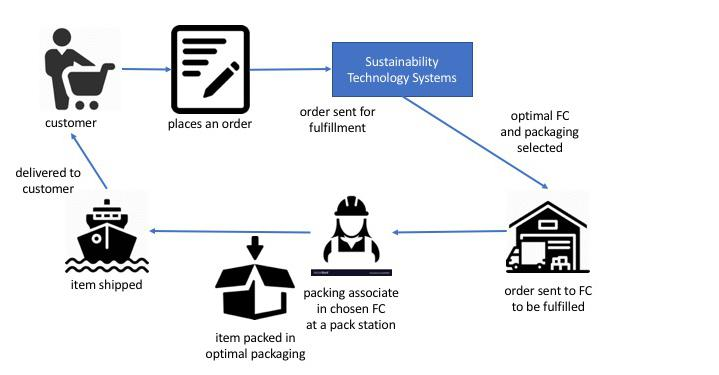

# Unit 3 Project: Sustainable Packaging

* * *

## Explaining Commit Comments:
MT3:
- Update our service to support Box, Polybag and future packaging types without requiring changes to the PackagingDao, FcPackagingOption, or the ShipmentService. We can do this by extending from the Packaging class. We know that no other teams use our types Java package, so it’s safe to change any of its classes. Both Box and PolyBag will need to implement themethods canFitItem() and getMass(), which are used to determine the best shipment option. 
- Update the PackagingDatastore. Its createFcPackagingOption() method creates Packaging objects that get used to create FcPackagingOptions. 
- Update ShipmentOption selection logic. We currently choose the option with the lowest monetary cost. However, we currently only know how to calculate the monetary cost of CORRUGATE packaging. We now have LAMINATED_PLASTIC as well. Update up MonetaryCostStrategy  to accurately calculate the cost of shipping polybags.

MT4:
- Update the PackagingDAO (and any other necessary classes) to detect and ignore duplicate FcPackagingOptions.
- Update the PackagingDAO so the findShipmentOptions() method only has to check the unique Packagings for the one provided FulfillmentCenter, instead of searching through all combinations. Reduce the number of checks from O(n*m) to O(m).
- Use a Builder pattern to provide a way to create a PolyBag.

MT5:
- Implement the CarbonCostStrategy in the strategy package using formulas from the Data Engineering team.
- Implement your design for the WeightedCostStrategy in the strategy package. Update the getCostStrategy() method in the App class to return your newly created WeightedCostStrategy instead of a MonetaryCostStrategy.

MT6:
- Update the ShipmentService to process the PackagingDAO‘s exceptions (the ShipmentService is "swallowing" exceptions thrown by the PackagingDAO and just returning null).

MT7:
- Update ShipmentServiceTest class to use mocks and avoid calling the actual PackagingDao. Since the PackagingDao depends on the PackagingDataStore we will have removed our use of actual data in our ShipmentService tests by mocking the PackagingDao.

## The Problem: Insisting on the Highest Packaging Standards

When customers order items from Amazon, they expect world-class service. That includes being responsible for the future
of our planet as we deliver value to each customer. As a new member of the Sustainability team, you will help Amazon
make environmentally smart decisions to live up to our customers' expectations.

Amazon chooses the best packaging option for each order from many available options. The "best" should not be
determined by just its packaging cost, but also its environmental impact. For example, sometimes the cheapest packaging
option is not the best choice because it ends up in a landfill instead of a recycling center, or because it is not
usable for returns. For the sake of this project, we will work with "singles" shipments, shipments that contain a single
item.

When an item is ready for shipment, it is sent to a packaging associate within the fulfillment center (FC) who places
the item in its packaging and sends it to the loading bay. These associates work at "packing stations" that include a
wide selection of packaging options. The packaging recommendation system tells the associate which packaging option to
use for each order. Packaging options vary by **type** and by **dimension**.

Each packing station has boxes and mailers of different sizes. The difference between a box and a mailer is a
difference in **type**, whereas the difference between a small box and a large box is a difference in **dimension**.
Refer to these typical packing stations to identify the boxes (the straight stacks) and the mailers (the curved
bundles).

&nbsp;

&nbsp;

Let’s take a closer look at some of the packaging **types** Amazon uses.

### Corrugate Box

&nbsp;

&nbsp;

Typically just called a "box," this is the most common type of packaging. You probably recognize the big Amazon smile
logo. They are relatively heavy compared to other packaging types. Some municipalities will recycle them, but the up
front material cost tends to be relatively high, and the quality of the cardboard degrades the more times they are
recycled. They are reusable as long as they are not damaged too much.

### SmartPack

&nbsp;

&nbsp;

SmartPacks are bubble mailers that can be recycled via store drop-off. They are harder to reuse than boxes because the
seal must be torn off to open the mailer. The bubbles offer some protection for fragile items, but mailers often result
in unnecessary packaging for smaller items. (We won’t work with these on this project.)

### Polybag

&nbsp;

&nbsp;

Smaller and lighter than both boxes and SmartPacks, polybags are made of 80% recycled plastic and are 100% recyclable.
They are also flexible, allowing a range of item shapes and sizes to be packed easily. Although they can be reused by
replacing the tape holding them shut, they do not protect their contents very well. (This project will involve adding
polybags as a packaging option to the existing shipment service.)

### Your task, should you choose to accept it...

As it stands, the software architecture of our service allows for a single packaging **type** with several
**dimensions**. As a member of the Sustainability team, you will extend the packaging recommendation system to make
environmentally smarter packaging selections. The packaging software runs in the "Sustainability Technology Systems"
part of the fulfillment process shown in this simplified
diagram:

&nbsp;

&nbsp;

You will extend the service to support different packaging types after calculating and considering their environmental
trade-offs. You will integrate these calculations into the selection process that decides how each item Amazon fulfills
is packaged.

## Technical Design

The SustainabilityShipmentService uses one API, `PrepareShipment`. This API provides the most cost effective
way to ship a single item from a specific fulfillment center (FC). The code to support this API is located in the
`ShipmentService` class. It is responsible for providing the shipment recommendation.

The `ShipmentService` uses the `PackagingDAO` to identify all shipping options available in an FC that will fit the
item. The `ShipmentService` then picks the shipment option with the lowest monetary cost and sends a shipping
recommendation back to the associate in the FC who is packing the item.

The project updates the service to support different packaging types, and to also consider sustainability, not just
monetary cost, when choosing the best shipment option.
